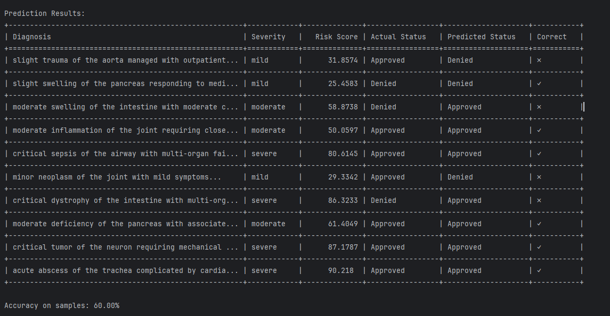

# Medical Claims Dataset Documentation

This repository contains code and data for a supervised learning project that predicts claim statuses based on textual and categorical data from medical claims.

## Column Descriptions

| Column Name               | Description                                                                                                                                              |
|---------------------------|----------------------------------------------------------------------------------------------------------------------------------------------------------|
| **claim_id**              | Unique identifier for each claim, representing a distinct insurance or medical claim.                                                                     |
| **diagnosis_description** | Descriptive text outlining the patient's primary diagnosis with severity indicators and specific medical conditions.                                      |
| **provider_notes**        | Textual notes from the healthcare provider detailing observations, vital signs, assessments, and treatment plans.                                         |
| **severity**              | Categorical indication of condition severity (`severe`, `moderate`, `mild`), providing additional context to the medical situation.                       |
| **risk_score**            | Numerical score (0-100) indicating the assessed risk level based on medical condition and severity.                                                       |
| **claim_status**          | Status of the claim as either `Approved`, `Denied`, or `Pending`, indicating the current processing stage or outcome.                                     |
| **label**                 | Numeric encoding of the `claim_status` column for machine learning purposes, with `0` for Approved, `1` for Denied, and `2` for Pending. Used as the target variable for prediction tasks. |

## Usage in the Supervised Learning Model

### 1. Feature Columns

#### Primary Text Features

- **`diagnosis_description`**: Medical condition details with varying severity and complications.
  - *Example*: "severe cardiac inflammation with systemic involvement"
  - Used by the BERT model for text understanding.
  - Combined with provider notes using the `[SEP]` token.

- **`provider_notes`**: Comprehensive clinical observations and plans.
  - *Example*: "Patient presenting with chest pain. Vitals: BP 160/95, HR 110. Assessment: Critical condition"
  - Processed by BERT alongside the diagnosis description.
  - Contains structured medical information.

#### Supporting Features (Additional Signals)

- **`severity`**: Categorical severity indicator.
  - Values: `severe` (2), `moderate` (1), `mild` (0)
  - Embedded into a 16-dimensional space before combining with BERT output.
  - Enhances the model's understanding of the medical condition's seriousness.

- **`risk_score`**: Numerical risk assessment.
  - Range: 0-100, normalized to 0-1 for model input.
  - Directly concatenated with BERT and severity embeddings.
  - Provides a quantitative measure of patient risk.

### 2. Target Variable

- **`label`**: Numeric encoding of `claim_status`:
  - `0`: Approved
  - `1`: Denied
  - `2`: Pending

This is the target variable for our supervised learning model.

## Approach: Supervised Learning

### Model Architecture

- **BERT** processes text features (`diagnosis_description` and `provider_notes`).
- **Severity** is embedded through a learnable embedding layer.
- **Risk score** is normalized and passed through a fully connected layer.
- **Combined features** (BERT output, severity embedding, risk score embedding) pass through a final classification layer.

### Feature Integration

```python
# Example of how features are combined in the model
bert_output = bert(input_ids=input_ids, attention_mask=attention_mask)
# Use CLS token hidden state
bert_features = bert_output.last_hidden_state[:, 0, :]  # Shape: (batch_size, hidden_size)

severity_emb
```

## Learning Process
- **Labeled Data**: Each data entry has a known outcome (claim_status or label), allowing the model to learn from labeled examples.
- **Classification Task**: The model is trained to classify claims into three categories based on patterns in all features.
- **Mixed Feature Types**: Combines text data with structured data to make predictions.

Supervised learning is ideal for this problem, as we aim to predict a known outcome based on historical data with predefined labels. The combination of rich textual data and supporting numerical/categorical features provides multiple signals for the model to learn from.

## Repository Contents
The repository includes the following key Python scripts:

### `data_generation.py`
- **Purpose**: Generates a synthetic dataset for training and testing the model.
- **Functionality**:
  - Creates realistic medical claims data with appropriate distributions.
  - Simulates various combinations of diagnoses, provider notes, severity levels, risk scores, and claim statuses.
- **Usage**: Run this script to produce the medical_claims_synthetic.csv dataset.

### `setup_verification.py`
- **Purpose**: Verifies the local environment setup and GPU availability.
- **Functionality**:
  - Checks if PyTorch is installed correctly.
  - Determines if a compatible GPU is available and accessible.
  - Prints out GPU properties and performs a simple tensor operation to confirm functionality.
- **Usage**: Run this script after setting up your environment to ensure everything is configured properly.

### `model_training.py`
- **Purpose**: Trains the BERT-based claim classification model.
- **Functionality**:
  - Loads the synthetic dataset and preprocesses the data.
  - Defines the model architecture and training parameters.
  - Trains the model, monitors performance, and saves the best model weights.
- **Usage**: Execute this script to train the model on the dataset. Adjust hyperparameters as needed for experimentation.

### `predict.py`
- **Purpose**: Performs inference using the trained model on new or existing data.
- **Functionality**:
  - Loads the trained model weights.
  - Processes input data and generates predictions for claim statuses.
  - Outputs the predictions for analysis or further processing.
- **Usage**: Use this script to make predictions with the trained model on new data samples.

## Training Performance and Plateau at 58%
During the training process, the model's accuracy plateaued at approximately 58%. This plateau suggests that the model was unable to improve beyond this point despite continued training. Several factors may contribute to this:

- **Class Imbalance**: The dataset may have an uneven distribution of claim statuses, causing the model to perform poorly on underrepresented classes.
- **Limited Feature Diversity**: The features used may not capture all the nuances necessary for accurate prediction.
- **Model Complexity**: The current model architecture might not be sufficient to capture complex patterns in the data.
- **Hyperparameter Settings**: The chosen learning rates, batch sizes, or number of epochs may not be optimal.

## Visualization of Prediction Results
Below is an example of the model's prediction results on the validation set:




The image illustrates the comparison between the true claim statuses and the model's predicted statuses. The discrepancies highlight areas where the model struggled to generalize effectively.

By analyzing these results, we can identify potential areas for improvement, such as:

- **Data Augmentation**: Increasing the size and diversity of the dataset.
- **Feature Engineering**: Incorporating additional relevant features.
- **Model Tuning**: Adjusting hyperparameters or experimenting with different model architectures.
- **Addressing Class Imbalance**: Implementing techniques like resampling or using class weights in the loss function.